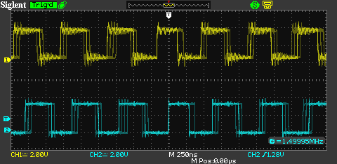

########################
lib_sw_dac: Software DAC
########################

|newpage|

************
Introduction
************

The Software DAC is a DSP driven component which takes a PCM input signal and 
converts it to a 1-bit output, at a high rate, which is then filtered using
simple filtering to produce an analogue signal. This removes the need for
traditional DAC components in many systems.

The software defined DAC comprises four major parts:

* An *upsampler* that consumes a 16-, 24-, or 32-bit signal at the *audio
  sampling rate* (eg, 48 kHz), and produces a 32-bit signal at the *PWM
  pulse rate* (eg, 1.5 MHz)

* A *modulator* that takes a 32-bit signal at the *PWM pulse rate* and
  computes *discrete* PWM values at that rate. Eg, it may use eight
  discrete levels [-3.5, -2.5, -1.5, -0.5, +0.5, +1.5, +2.5, +3.5] and
  approximate the signal 0.0 by outputting -0.5, +0.5, -0.5, +0.5, -0.5,
  +0.5, ...

* A PWM generator that creates a PWM signal at the *PWM pulse rate* and
  outputs to GPIO pins on the *xcore.ai* device. The
  edges of the PWM signal are precisely timed at discrete points in time.
  In order to achieve this, a *master clock* is used that is a whole
  multiple of the *pwm pulse rate*.

* An external analogue hardware and low-pass filter and amplifier that filter out inaudible signals and drive the analogue signal to a headphone or speaker with a suitable voltage and impedance.

These four parts are shown in :numref:`sw_dac_stages`.

.. _sw_dac_stages:

.. uml::
   :width: 100%
   :caption: Software DAC Stages

    @startuml
    
    skinparam rectangle {
    BackgroundColor #cceeff
    BorderColor #4477aa
    RoundCorner 5
    }

    rectangle "Upsampler " as S1
    rectangle "Sigma Delta Modulator" as S2
    rectangle "PWM Generator" as S3
    rectangle "Analog Filter" as S4

    :PCM samples: --> S1
    S1 -right-> S2
    S2 -right-> S3
    S3 -right-> S4
    S4 --> :Analogue Output:

    @enduml

Each of these stages can be made as refined as one likes. The quality of
the output signal is typically determined by the weakest of these
stages. Hence, there is no point in making one of the stages a lot
better than all the others and instead should be balanced in terms of performance.

Example configurations are provided.

|newpage|

*********
Operation
*********

The signal is processed in fixed-point arithmetic, but for the purpose
of explaining the operation, we assume that a full-scale signal is represented by real numbers in
the range [-1.0..1.0]. The signal's internal representation takes many
forms (Q3.29, Q4.28), but these are hidden from the user as long as all
filter and modulator coefficients are represented in Q2.30 format.

DC removal
----------

The digital pipeline starts by removing the DC component in the signal
using a high-pass filter with a cut-off frequency of around 1 Hz.
Performing this task digitally can reduce BOM cost by removing the
need for AC coupled stages. DC removal can be switched off if it is undesirable.
For details, see :c:macro:`SW_DAC_DC_REMOVAL_TIME_CONSTANT`.

Up-sampling
-----------

Assuming an input sample rate of 48 kHz and an PWM pulse rate of 1.5 MHz
the audio signal needs to be upsampled by about 32x. The filter(s) used in
upsampling can be made longer (less ripple), or shorter (less compute) and
can be made symmetric (constant group delay) or asymmetric (less
latency) as needed. The number of filters can be changed too, although for pragmatic
reasons it is good to start with 2x upsamplers as that creates natural
input points for 96 and 192 kHz sample rates if multiple input sample rate is required.

In order to support the 44,100 family, one can either support:

* A dual master clock configuration.
* A fractional sample rate converter at the input stage.
* A design the final filters to perform the fractional conversion at that stage.

PWM pulse rate and levels
-------------------------

The PWM pulse rate governs the frequency of PWM pulses. A high pulse rate
produces a better noise floor but requires more compute. A lower pulse rate
may be preferable when driving a class-D style amplifier which may have an
upper limit on output stage switching frequency.

Each PWM pulse has a discrete length. The number of lengths available is
called the number of PWM levels. Higher numbers of PWM levels produce a
lower noise floor. The PWM levels used are always symmetrical around zero,
enabling negative and positive signals of the same magnitude to be created.

Hence, if the number of PWM levels is odd, then the middle level will be 0,
and the values -1, +1, -2, +2 etc will be used. If the number of PWM levels
is even, then the two middle values will be +/-0.5, and the values -1.5,
+1.5, -2.5, +2.5 etc will be used.

.. note::
    At power on, the ``xcore.ai`` GPIO ports are set to high impedance with a
    weak pull-down enabled. This will define the initial state of the output 
    ports until the software DAC is configured and operating.

Master clock frequency
----------------------

The master clock frequency is an integer multiple of the PWM pulse rate,
because each PWM pulse is constructed of a whole number of master clock
periods. The master clock is either the number of PWM levels multiplied by the PWM
pulse rate, in which case PWM pulses will be asymmetric, or, PWM pulses can
be are made symmetrical requiring the master clock to be twice that rate.

Modulator design
----------------

The modulator comprises the following parameters:

* A matrix that governs the modulator design. The modulator has a state,
  which is the value of each of the accumulators: a vector of six values
  for a sixth order modulator. Given the current state of the modulator,
  the new input value, and the quantized output value, the matrix is used
  to compute the next state. Hence, on each iteration the following
  computation takes place::

     vector[0] = input
     vector[1] = quantize(state[5])
     vector[2:7] = state
     state = matmul(CM, vector)

  where state is a vector with six elements, enabling a modulator of up to
  sixth order to be implemented.

  All elements of the matrix must have a magnitude less than 2.0. Note that
  there is no post-multiplication: if your design has a multiplication
  between the final accumulator and the quantizer, then you should arrange
  the matrix so that that multiplier is 1.0. This demand can be achieved by
  dividing that column of the matrix by the final multiplier, and
  multiplying the associated row by the final multiplier. The same method
  can be used to make sure that all elements have a magnitude of less than
  2.0. Note that it is undesirable for the first column of the matrix
  (which governs the inputs) to have very small values as that prohibits
  low magnitude signals (say, less than -130 dB) to be modulated.

* A scale factor that converts the full scale input value (a number in the
  range -1.0..1.0) to an input value for the modulator. The number is
  specific to the modulation matrix and is limited by the number of PWM
  levels. Say that the maximum PWM levels are +/- 3.5, then the scale
  factor will be less than 3.5. If the scale is too close to full scale PWM
  you will get distortion at full-scale, so a typical scale value may be
  3.0 or 2.9.

* A limiter for the full-scale input value. You can set the limiter to 1.0,
  or you may choose to set it higher, depending on whether you would want
  to faithfully represent an upscaled sine-wave of a quarter of the input
  sample rate. The limiter must be less than 2.0 and greater or equal to
  1.0.

Signal negation
---------------

Depending on the final output circuitry, it may be desirable to invert the 
output signal. An optional negate parameter is available to do this,
see :c:macro:`SW_DAC_NEGATE`.

Pre-distortion
--------------

Before the signal is passed into the modulator it can be pre-distorted.
Pre-distortion includes 2 types of signal compensation:

* Flat compensation
* PWM compensation

Flat compensation applies a fixed transformation to the input signal 
to counteract non-linearities introduced by the analogue output stage.
This adjustment is hardware-dependent and helps reduce distortion across
the entire signal range.

PWM compensation modifies the input signal based on the characteristics of the
modulation matrix and PWM process, typically tailored to correct specific artifacts
introduced by the digital modulator, improving overall signal fidelity.

Both are implemented in the form of ``c2 * x^2 + c3 * x^3``,
with a high-pass filter for the PWM compensation.
If the user wishes to disable pre-distortion, they would need to set all coefficients to zero.

Generation of master clock and synchronisation
----------------------------------------------

The master clock may be generated outside the XCORE (using a crystal
oscillator or external PLL), or inside the XCORE (using the secondary PLL
in the XCORE or using the core PLL).

An externally generated PLL can support lower jitter than an internally generated
PLL creating a better noise floor.

When using an externally-generated clock you must resynchronise the PWM
stream with that clock using a D-type flip-flop in order to minimise jitter
in the PWM edges since the GPIO output from the XCORE is synchronised to the
internal core clock which typically operates at 600 MHz or 800 MHz.

Analog filter and amplifier
---------------------------

Assuming that the direct signal is too low an amplitude level or too high impedance, you can
either:

* Use an external head-phone amplifier.

* Directly drive a class-D style amplifier (H-bridge)

It is recommended to use a low-pass filter if driving a head-phone amplifier.
Depending on the required output bandwidth, a second order, linear-phase low pass filter with a
cut-off point between 24 kHz and 48 kHz may be suitable.

|newpage|

****************************
Customising The Software DAC
****************************

Starting point for the design
-----------------------------

As the design is highly configurable we provide a set of options to start
with. They have been chosen so that you can make the design better (and
more expensive) or cheaper (with a higher noise floor).

.. note:: All the design parameters are tied together by the choice of 
    modulator. The modulator is designed for a specific number of PWM levels at
    a specific pulse rate.

Modulator sd_coeffs_o6_f1_5_n8
------------------------------

This is a 6th order modulator that outputs eight PWM levels at a 1.5 MHz
pulse rate. The eight levels are [-3.5, -2.5, -1.5, -0.5, +0.5, +1.5, +2.5,
+3.5]. The default scale is 2.9 and the default limit is 2.9. The modulator
introduces a delay of 6/1.5 MHz = 4 us.

The default pre-distortion values are tuned to remove second and third harmonics
from this modulator:

* flat_x2: 1.0/120000

* flat_x3: -1.0/250000

* pwm_x2: 3.0/157

* pwm_x3: 0.63/157

* scale: 2.8544

* limit: 2.8684735298

Upsampler filter_x125_4
-----------------------

The default upsampler is

* 48 kHz in, x2, 96 kHz out, 80 taps, 416 us latency

* 96 kHz in, x2, 192 kHz out, 32 taps, 83 us latency

* 192 kHz in, x2, 384 kHz out, 16 taps, 20.8 us latency 

* 384 kHz in, x2, 786 kHz out, 16 taps, 10.4 us latency

* 786 kHz in, x125/64, 1500 kHz out, 2000 taps, 10.4 us latency

With all filters symmetrical and a constant group delay.

If desirable, one could change the final filter to 2x, the clock to 24.576,
and the PWM pulse rate to 1.536 MHz without many other changes.

Master clock and analogue amplifier
-----------------------------------

By default, we create symmetrical PWM pulses, hence we use a master clock
of 1.5 MHz x 8 x 2 = 24 MHz. Our example design uses an external 24 MHz
oscillator with an external D-type resynchroniser that use a low-noise LDO
not used by the digital circuitry. For cost reduction, one can generate 24 MHz
directly from a shared oscillator with the XCORE, or directly from the
XCORE if ran at 600 MHz (600/25 = 24 MHz); this will raise the noise floor
as this clock has more jitter.

The example design uses a low-noise LDO with a D-type flop to resynchronise
the signal, leading into a low-cost head-phone amplifier using low-noise
resistors. 

|newpage|

**************************
Performance Considerations
**************************

The default headphone amplifier configuration produces audio performance 
characterised by :numref:`default_performance` which is for sw_dac_sf()
where `sf` means standard fidelity:

.. table:: Typical performance
   :name: default_performance

   ================= =============== ===============
   \                 Analog output   Digital output
   ================= =============== ===============
   Dynamic Range      106.5 dB        122 dB
   THD                -117 dB         -122 dB
   THD+N              -120 dB         -117 dB
   ================= =============== ===============

.. note::
    In this table, the digital output is the signal that the XCORE produces, assuming an
    ideal output stage, post D-type resynchronisation flipflop. The Analog output is the signal as measured on the
    3.5mm headphone jack. The difference between the two is due to
    the design of the analog stage where noise is added in from various
    sources.

Three sorts of inaccuracies are created in the process of Digital to Analogue
conversion:

Noise
-----

The noise floor comprises the (root-mean-squared) sum of all noise sources.
These noise sources may include but are not limited to:

* Noise floor of the modulator, you can reduce this by running the
  modulator faster and/or with a higher order

* Noise of the analogue power supplies. You can reduce these by using
  better power supplies.

* Jitter in the clock. You can reduce this by running the clock faster, and
  by using a low-jitter clock source.

* Noise of analog components (resistors, capacitors, op-amps), you can
  reduce these by using more expensive components.

Harmonics (of the input signal)
-------------------------------

The harmonics of the signal are mostly introduced by the modulator, and to
a lesser extent, by the analogue amplifier. They can be reduced by pre-distorting the signal.

Cross-talk (between channels)
-----------------------------

Cross-talk is introduced because of shared analogue components between
multiple channels (power-supplies, resynchronisers, etc). Cross-talk can be
reduced by replicating those components.

The default design may be sufficient for many applications, but for some
applications you may choose to spend more BOM and XCORE MIPS on a solution with
less noise, harmonics, and/or cross-talk.

|newpage|

.. _api_section:

*************
API Reference
*************

The Software DAC main task, ``sw_dac_sf()``, comprises of two threads which can be seen, alongside the sample producing app, in :numref:`software_dac_usage`

.. _software_dac_usage:

.. uml::
   :width: 100%
   :caption: Software DAC usage task diagram

   @startuml
   left to right direction
   circle producer_app

   rectangle "Software DAC"{
       circle upsampling_filter
       circle sigma_delta_task
   }

   rectangle output_ports

   producer_app --> upsampling_filter : API channel
   upsampling_filter --> sigma_delta_task : internal channel
   sigma_delta_task --> output_ports
   @enduml

All functions can be accessed via the ``sw_dac.h`` header::

  #include "sw_dac.h"

You will also have to add ``lib_sw_dac`` to the application's ``APP_DEPENDENT_MODULES`` list in
`CMakeLists.txt`, for example::

    set(APP_DEPENDENT_MODULES "lib_sw_dac")

Configuration Header
--------------------

Various settings are set statically. These are picked up from your project directory from the
``sw_dac_conf.h`` file. Default settings are used if this file is not present along with 
a warning that the defaults are being used. You may create an empty ``sw_dac_conf.h`` if
you wish to use default settings and remove the compiler warning.

.. doxygendefine:: SW_DAC_NEGATE

.. doxygendefine:: SW_DAC_DC_REMOVAL_TIME_CONSTANT

The full listing of ``sw_dac_conf_default.h`` is shown below.

.. literalinclude:: ../../lib_sw_dac/api/sw_dac_conf_default.h
    :language: c
    :lines: 12-27

|newpage|

Supporting types
----------------

The following type is used to configure the software DAC components.

.. doxygenstruct:: sw_dac_sf_t

It is not necessary to directly modify this structure and can be considered a black-box.
Please configure it using the :ref:`sw_dac_sf_init()<init_api_sf>` function.

Creating a software DAC instance
--------------------------------

.. _init_api_sf:

.. doxygenfunction:: sw_dac_sf_init

.. doxygenfunction:: sw_dac_sf

For the initialisation of the structure using ``sw_dac_sf_init()`` one can choose from the following
pre-defined modulators:

.. doxygenvariable:: sd_coeffs_o6_f1_5_n8

|newpage|

Supporting functions
--------------------

.. _watchdog_api:

.. doxygendefine:: PLATFORM_OSCILLATOR_FREQUENCY_HZ

.. doxygenfunction:: watchdog_init

.. doxygenfunction:: watchdog_reset_counter

.. doxygenfunction:: watchdog_has_tiggered

|newpage|

.. _example_design_section:

*******************
Example application
*******************

A simple example is provided that generates a 62.5 Hz sine wave and outputs it to both channels of the software DAC as sigma-delta modulated PWM. 
The hardware used is the `xcore.ai development board <https://www.xmos.com/xk-evk-xu316>`_ although any ``xcore.ai`` development board should work 
as long as two one bit ports are available and can be monitored using an oscilloscope or logic analyser.

.. warning::
    The used hardware platform *does not* include the necessary D-type flip-flops or analogue output stage and so the performance will be significantly worse than that described in :numref:`default_performance`.
    However, using an oscilloscope will still allow you to see the PWM output and verify correct operation. It is also possible to connect a pair of headphones directly to the output ports, but this is not
    recommended without a DC blocking capacitor as it may damage the headphones or the hardware. Further, the output will be quite quiet due to the limited output
    drive capability of the GPIO pins and lack of a gain stage.

Building the example
--------------------

This section assumes that the `XMOS XTC Tools <https://www.xmos.com/software-tools/>`_ have been
downloaded and installed. The required version is specified in the accompanying ``README``.

Installation instructions can be found `here <https://xmos.com/xtc-install-guide>`_.

Special attention should be paid to the section on
`Installation of Required Third-Party Tools <https://www.xmos.com/documentation/XM-014363-PC/html/installation/install-configure/install-tools/install_prerequisites.html>`_.

The application is built using the `xcommon-cmake <https://www.xmos.com/file/xcommon-cmake-documentation/?version=latest>`_
build system, which is provided with the XTC tools and is based on `CMake <https://cmake.org/>`_.

The ``lib_sw_dac`` software ZIP package should be downloaded and extracted to a chosen working
directory.

To configure the build, the following commands should be run from an XTC command prompt::

    cd lib_sw_dac/examples/app_sf_sine
    cmake -G "Unix Makefiles" -B build

If any dependencies are missing they will be retrieved automatically during this step.

The application binaries should then be built using ``xmake``::

    xmake -j -C build

Binary artifacts (.xe files) will be generated under the appropriate subdirectories of the
``app_sf_sine/bin`` directory — one for each supported build configuration.

For subsequent builds, the ``cmake`` step may be omitted.
If ``CMakeLists.txt`` or other build files are modified, ``cmake`` will be re-run automatically
by ``xmake`` as needed.

Running the example
-------------------

From an XTC command prompt, the following command should be run from the ``examples/app_sf_sine``
directory::

    xrun ./bin/app_sf_sine.xe

Alternatively, the application can be programmed into flash memory for standalone execution::

    xflash ./bin/app_sf_sine.xe

The PWM output may be monitored on pins ``36`` and ``38`` of connector J10 of the `xcore.ai development board <https://www.xmos.com/xk-evk-xu316>`_
which correspond to ports ``XS1_PORT_1M`` and ``XS1_PORT_1O`` respectively.

An oscilloscope capture of the output can be seen in :numref:`pwm_example_output`. Here you can clearly see the PWM output switching at 1.5 MHz
and the discrete PWM levels as the sine wave varies slowly over time. The top trace is the left output, on which the waveform is triggered,
and the bottom trace is the right output.

.. _pwm_example_output:

   PWM Example Output

|newpage|

***********************************
Software DAC Implementation Details
***********************************

Architecture
------------

This document explains the implementation of a software DAC on one or more
XCORE threads. The software DAC takes a PCM signal, for example 32 bits @
48 kHz, and produces a PDM/PWM signal on a one bit port that, when filtered
through a low pass filter, produces the analogue equivalent of the PCM
signal.

The purpose of the software DAC is, in an audio context, to be able to
drive line-level, headphones, or class D directly from an XMOS chip. It may
also be useful in other environments where a DAC is required.

As a running example, we assume that the software DAC reproduces a 48 kHz
32-bit PCM stream. But the principles can be applied to other bit-depths,
sample rates, or domains.

General structure
-----------------

The general structure of the software DAC is as follows. In a loop:

#. A 48 kHz N 32-bit sample arrives

#. high precision 2x upsampler; making two 96 kHz 32-bit samples

#. medium precision 2x upsampler, ran twice, making four 192 kHz 32-bit samples

#. low precision 2x upsampler, ran four times, making eight 384 kHz 32-bit samples

#. Sigma-delta ran on each of the eight 384 kHz samples, producing eight
   quantised values

#. Quantised values are output as PWM or PDM

When there is more than one sample, these six steps are all executed once
for each channel.

The sigma delta can be ran more than once on the 384 kHz sample, producing
an oversampled sigma delta value. This allows a trade-off between the
number of quantised values and the pulse rate on the output.

PWM output
----------

We describe PWM output as a stream of bits that is output on a
master-clock. The master clock frequency dictates the resolution of the
PWM.

We assume that PWM outputs a discrete number of levels, for example 9
levels (-4,-3,-2,-1,0,+1,+2,+3,+4). As there are 9 levels it need 8 single bits
to represent this (``0000.0000``, ``0000.0001``, ``0000.0011``, ``0000.0111``, 
``0000.1111``, ``0001.1111``, ``0011.1111``, ``0111.1111``, ``1111.1111``).
We are using a ``.`` for ease of recognising where the '0' value is.

In order to create a signal with few harmonics, the falling and rising
edges have to be driven symmetrically, eg the value -2 would be driven as
``0000.0011-1100.0000``. We are using a ``-`` to denote the point of
symmetry.

Considerations:

* Each PWM is represented by exactly the same number of master clock cycles
  (16 in the example above)

* There is a trade-off between the number of levels and the pulse-rate of
  the PWM

* It does not have to be strictly symmetrical; a slightly different number
  of bits can be driven high on the left and right side, providing an
  opportunity for some extra resolution. Eg ``0000.0011-1110.0000``
  represents a value that is somewhere between -2 and -1.

Precise output timings
----------------------

The PWM or PDM output has to be driven on precise times; as such, the
software is scheduled in quanta that enables all ports to be kept busy all
the time. (An alternative is to use timed outputs for the edges, we are
ignoring that alternative here as the place where the output has to happen
moves in time with the PWM value.)

As an example, we describe a schedule that uses a 49.152 MHz master-clock
to drive the PWM signal; a 48 kHz input sample rate, and four channels.
Please note that these numbers are examples only.

* We use a PWM with 65 levels [-32, -31, -30, ..., -1, 0, 1, ..., 32]

* This requires 64 + 64 = 128 bits to output

* 128 bits at 49.152 MHz gives a pulse rate of 384 kHz (49.152 MHz / 128)

* Hence, we need to create at least eight PWM levels per 48 kHz cycle.

* We have 1,024 bit times per 48 kHz sample (1024 x 48 = 49.152).

* They are output in chunks of 32 bits on a buffered port, requiring 32
  outputs per channel. A sequence of four outputs outputs a single PWM
  level (4 x 32 = 128 bits). A sequence of 8 x 4 outputs outputs the 1024
  bits.

* At 48,000 Hz sample rate with a 600 MHz processor running 8 threads we
  have 75,000,000/48,000 = 1562 issue slots between samples

* 32 outputs spread evenly over 1562 issue slots means that outputs have to
  happen every 1562 / 32 = 48 issue slots.

This creates 32 quanta of 48 issue slots each that could, for example, be
filled as follows. We assume we have two PWM buffers A and B (described
later, A and B are double buffers). We output bits from PWM buffer A, and
fill PWM buffer B:

#. Output bits 0..31 on all channels, this output is from buffer A, as are
   all the subsequent outputs.

   Receive 48 kHz sample on channels 1,
   2, 3

#. Output bits 32..63 on all channels.
   
   Run high precision 2x upsampler on
   channel 0

#. Output bits 64..95 on all channels.
   
   Run medium precision 2x upsampler
   twice on channel 0
   
#. Output bits 96..127 on all channels.
   
   Run low precision 2x upsampler four
   times on channel 0
   
#. Output bits 128..159 on all channels.
   
   Run delta sigma twice on upsamples
   0 & 1, store output in PWM array B
   
#. Output bits 160..191 on all channels.
   
   Run delta sigma twice on upsamples
   2 & 3, store output in PWM array B
   
#. Output bits 192..223 on all channels.
   
   Run delta sigma twice on upsamples
   4 & 5, store output in PWM array B
   
#. Output bits 224..256 on all channels.
   
   Run delta sigma twice on upsamples
   6 & 7, store output in PWM array B

Repeat this sequence three more times for channels 1, 2, and 3. then at the end,
we swap buffers A and B and continue for the next iteration.

For this scheme to work, we need to fit an ``Output`` and an activity
(upsample; delta-sigma, etc), inside 48 issue slots.

As stated before, this is just an example for quad channel with a master
clock of 49.152 MHz and upsampled eight times. Other schedules can be
created to, for example, run the delta-sigma twice as often on half the
number of channels and drive the PWM at a higher or asymmetric pulse rate,
and/or use a different number of PWM levels.

Output clock
------------

PWM output can either be generated at 49.152 MHz by clocking off the
secondary PLL (and by using an external flop to realign the edge), or it
can be generated at 50.000 MHz by using the reference clock divided by 2.

In order to achieve the latter, an SRC has to be implemented from 49.152 to
50 MHz, which is a ratio of 3125 : 3072 (5^4 : 3 x 2^10). Hence, the signal
has to be upsampled by 3,125 x, and then be low pass filtered, and
subsampled by 3,072 x.

Running this sample rate conversion at 384 kHz enables us to use a fairly
imprecise filter. If we create a filter with, say, 3 x 3,125 taps, then we
need 3,125 phases of the filter with four taps each, where the phases move
over the filter

Implementation
==============

Data output
-----------

The output function uses

* r0, r1, r3, r11 as scratch registers

* r9 as a pointer in the output data structure (see later)

It requires 8 issue slots

High precision filter for 2x upsampling
---------------------------------------

The high precision filter uses

* r2, r3, and r11 as scratch registers

* r5 as a pointer to an array of 40 input samples, with 1 word in front that will
  be overwritten

* r4 points to an array of at least 8 words where the 2 output samples will
  be written (with 6 words being overwritten with random values)

* The filter is assumed to be stored in a global variable
  ``filter_hashed_80_2`` comprising 5 x 2 x 8 words.

It requires XXX issue slots

Medium precision filter for 4x upsampling
-----------------------------------------

The medium precision filter uses

* r2, r3, and r11 as scratch registers

* r4 as a pointer to an array of 16 input samples, with 2 words in front that will
  be overwritten

* r1 points to an array of at least 8 words where the 4 output samples will
  be written (with 4 words being overwritten with random values)

* The filter is assumed to be stored in a global variable
  ``filter_hashed_28_4`` comprising 4 x 4 x 8 words.

It requires XXX issue slots

Low precision filter for 8x upsampling
--------------------------------------

The low precision filter uses

* r2, r3, and r11 as scratch registers

* r1 as a pointer to an array of 16 input samples, with 4 words in front that will
  be overwritten

* r0 points to an array of 8 words where the 8 output samples will
  be written

* The filter is assumed to be stored in a global variable
  ``filter_hashed_16_8`` comprising 2 x 8 x 8 words.
  
It requires XXX issue slots

Sigma delta
-----------

The sigma delta filter uses

* r1, r3, and r11 as scratch registers

* r2 as its input value

* r0 to point to the state (11 words; the state is held in words 3..7;
  words 8..10 are overwritten and unused, words 0..2 are used for the input
  and output values).

* The matrix coefficients are assumed to be store in a global variable
  ``xxx`` comprising 5 x 8 words. For the five rows of data, the first
  value is the multiple of the input value. The second value at index [1] is
  the multiplicand for the feedback, and values 3..7 are the values for
  each of the accumulators.

* A PWM lookup table is assumed to be stored in ``pwm_tableXXX``

* Output is written to register ``XXX``

It requires 16 issue slots + PWM lookup

PWM Output data-structure
-------------------------

The output comprises an array comprising 4 x 8 x 4 x 8 = 1024 bytes that stores
port-identifiers and values for for channels as follows (assuming quad
channel):

  ===== ======= ======= ===== ===== ======= ======= ===== ===== =========
        0x00    0x04    0x08  0x0C  0x10    0x14    0x18  0x1C  bits
  ===== ======= ======= ===== ===== ======= ======= ===== ===== =========
  0x000 prtid 0 prtid 1 val 0 val 1 prtid 2 prtid 3 val 2 val 3 0..31
  0x020 prtid 0 prtid 1 val 0 val 1 prtid 2 prtid 3 val 2 val 3 32..63
  0x040 prtid 0 prtid 1 val 0 val 1 prtid 2 prtid 3 val 2 val 3 64..95
  0x060 prtid 0 prtid 1 val 0 val 1 prtid 2 prtid 3 val 2 val 3 95..127
  0x080 prtid 0 prtid 1 val 0 val 1 prtid 2 prtid 3 val 2 val 3 128..159
  ... 
  0x360 prtid 0 prtid 1 val 0 val 1 prtid 2 prtid 3 val 2 val 3 992..1023
  ===== ======= ======= ===== ===== ======= ======= ===== ===== =========

For stereo the data is stored in an array half the size as follows:

  ===== ======= ======= ===== ===== =========
        0x00    0x04    0x08  0x0C  bits
  ===== ======= ======= ===== ===== =========
  0x000 prtid 0 prtid 1 val 0 val 1 0..31
  0x010 prtid 0 prtid 1 val 0 val 1 32..63
  0x020 prtid 0 prtid 1 val 0 val 1 64..95
  0x030 prtid 0 prtid 1 val 0 val 1 95..127
  ...
  0x1F0 prtid 0 prtid 1 val 0 val 1 992..1023
  ===== ======= ======= ===== ===== =========

The array is double buffered; that is one array is written by the
sigma-delta modulators, whilst the other is being played out on the output
pins.

Part 2: going to the core clock
-------------------------------

The general structure of the software DAC is as follows. In a loop:

#. A 48 kHz N 32-bit sample arrives

#. high precision 2x upsampler; making two 96 kHz 32-bit samples

#. medium precision 2x upsampler, ran twice, making four 192 kHz 32-bit samples

#. low precision 125/48x upsampler, ran four-five times, making eight-ten 500 kHz 32-bit samples

#. Sigma-delta depth of -25..+25, represented by 50 quanta left and 50 quanta
   right for a total of 100 quanta
   
#. Sigma-delta ran on each of the eight-ten 500 kHz samples, producing 800
   to 1000 quantas. Over a period of one second:

   * 48,000 samples will have arrived

   * These have been upsampled to 500,000 samples

   * These have produced 50,000,000 quanta

#. The quanta are clocked out at 50 MHz.

Timings
-------

The basic timing unit is 500 us.

* 24 samples will have arrived

* These have been upsampled to 250 samples

* These have produced 25,000 quanta, 3,125 bytes of data.

This is comprised of two circular groups:

* Loop 1 is 12 samples in, 125 samples out. This is a sequence:

  * Sample 0 produces 10 outputs, total 10

  * Sample 1 produces 10 outputs, total 20

  * Sample 2 produces 11 outputs, total 31

  * Sample 3 produces 10 outputs, total 41

  * Sample 4 produces 11 outputs, total 52

  * Sample 5 produces 10 outputs, total 62

  * Sample 6 produces 10 outputs, total 72

  * Sample 7 produces 11 outputs, total 83

  * Sample 8 produces 10 outputs, total 93

  * Sample 9 produces 11 outputs, total 104

  * Sample 10 produces 10 outputs, total 114

  * Sample 11 produces 11 outputs, total 125

* Loop 2 is a quantum loop that works as follows:

  * PWM pulse 0, 100 bits in, total of 3 words and 4 bits

  * PWM pulse 1, 100 bits in, total of 6 words and 8 bits

  * PWM pulse 2, 100 bits in, total of 9 words and 12 bits

  * PWM pulse 3, 100 bits in, total of 12 words and 16 bits

  * PWM pulse 4, 100 bits in, total of 15 words and 20 bits

  * PWM pulse 5, 100 bits in, total of 18 words and 24 bits

  * PWM pulse 6, 100 bits in, total of 21 words and 28 bits

  * PWM pulse 7, 100 bits in, total of 25 words exactly

THe two groups together repeat at the LCM of 125 and 8, which is 1,000
upsampled values for 96 input values or 2 ms. This is not a loop that we
can design our software around. So we have to accept that we don't unroll
them completely.

Hence, we will need to have a PWM function that just appends 100 bits, and
a upsampler that produces 10 or 11 samples, and make the PWM generator cope
with getting either 10 or 11 samples thrown at it.

This means that the whole loop will comprise:

* output  0;   Get samples L & R

* output  1;   2x upsample L

* output  2;   4x upsample L

* output  3;   125/48x upsample L

* output  4..13;   sigma-delta 0..9 L

* output 14;   optional sigma-delta 10 R

* output 15;   2x upsample R

* output 16;   4x upsample R

* output 17;   125/48x upsample R

* output 18..27;   sigma-delta 0..9 R

* output 28;   optional sigma-delta 10 R

That has output 32 * 28 = 896 quanta and has produced 1000 or 1100 quanta,

* output 29 up to (31 to 35) output quanta to empty buffer far enough

So we'll have a FIFO that has a multiple of 25 words in it. It will be
checked every 25th word whether it needs to wrap or not. The reader will
run at least 35 words behind the writer, so a 75 word FIFO should do.

==== ===== ====== ============================================
Read WritL WritR  Stage
==== ===== ====== ============================================
0    36    36     output  0;   Get samples L & R
1    36    36     output  1;   2x upsample L
2    36    36     output  2;   4x upsample L
3    36    36     output  3;   125/48x upsample L
4..  36..  36     output  4..13;   sigma-delta 0..9 L
14   67    36     output 14;   optional sigma-delta 10 R
15   67    36     output 15;   2x upsample R
16   67    36     output 16;   4x upsample R
17   67    36     output 17;   125/48x upsample R
18.. 67    36..   output 18..27;   sigma-delta 0..9 R
28   67    67     output 28;   optional sigma-delta 10 R
29   67    67     output 29
30   67    67     output until 67-37 items
31   67    67     output  0;   Get samples L & R
32   67    67     output  1;   2x upsample L
33   67    67     output  2;   4x upsample L
==== ===== ====== ============================================

Output data-structure
---------------------

The output comprises a single array comprising 75 x (2+2) x 4 = 1200 bytes
that stores port-identifiers and values for each of the two channels as
follows (stereo only):

  ===== ======= ======= ===== ===== ========== =========
        0x00    0x04    0x08  0x0C  bits       Word
  ===== ======= ======= ===== ===== ========== =========
  0x000 prtid 0 prtid 1 val 0 val 1 0..31      0
  0x010 prtid 0 prtid 1 val 0 val 1 32..63     1
  0x020 prtid 0 prtid 1 val 0 val 1 64..95     2
  0x030 prtid 0 prtid 1 val 0 val 1 95..127    3
  ...
  0x4A0 prtid 0 prtid 1 val 0 val 1 2368..2399 74
  ===== ======= ======= ===== ===== ========== =========

The array is single buffered. There is a write pointer that starts at 50, it
is incremented in partial words, but every 25 words it is on a whole-word
boundary; that is when it is checked for wrapping back to 0.

The read pointer starts at word 50-36 = word 14.
